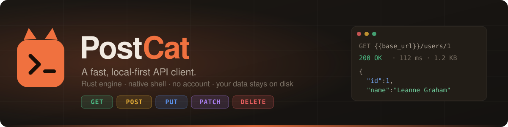
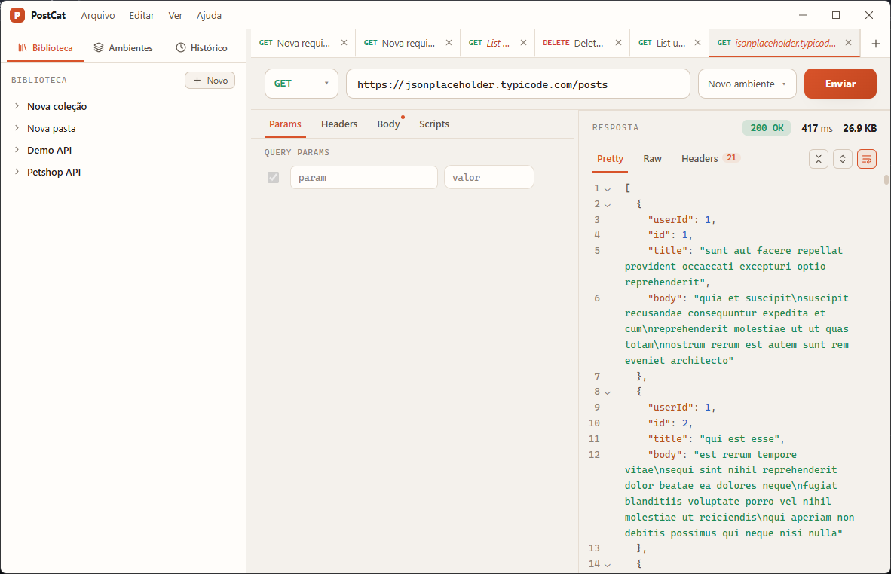

<p align="center">
  
</p>

<p align="center">
  <a href="https://github.com/lbss9/postcat/blob/main/LICENSE"></a>
  
  
  
  
  
  <a href="https://github.com/lbss9/postcat/releases/latest"></a>
  <a href="https://github.com/lbss9/postcat/commits/main"></a>
</p>

<p align="center">
  <a href="#install">Install</a> ·
  <a href="#features">Features</a> ·
  <a href="#scripting">Scripting</a> ·
  <a href="#themes">Themes</a> ·
  <a href="#architecture">Architecture</a> ·
  <a href="#building-from-source">Build</a> ·
  <a href="#roadmap">Roadmap</a>
</p>

PostCat is a desktop API client that stays out of your way. It is small, it starts fast, and it
keeps everything on your disk: no account, no sync, no telemetry. The HTTP engine is written in
Rust, the shell is Tauri 2, and the interface is React with its own identity rather than a copy of
anything else.

<p align="center">
  <picture>
    <source media="(prefers-color-scheme: dark)" srcset="docs/assets/screenshot-dark.png" />
    
  </picture>
</p>

## Why another API client

- **Local-first.** Collections, environments and history live in a SQLite file in your app data
  folder. Export what you want to share; nothing leaves the machine on its own.
- **Light.** A Tauri window over the system WebView plus a Rust binary. No bundled browser, no
  background services, no login wall.
- **Built to be looked at.** Frameless window with its own title bar and menus, a two-pane layout
  with draggable splits, coral accent, HTTP methods colour-coded everywhere, themes as plain JSON.

## Features

**Request builder**

- Query params and path variables (`/users/:id` becomes an editable table), headers with the
  auto-generated ones visible on demand
- Bodies: `form-data` (text or file per row), `x-www-form-urlencoded`, `raw` with a language
  selector (Text, JSON, JavaScript, HTML, XML) and a formatter, and `binary`
- `{{variables}}` resolve from the active environment in every field. They render as solid chips:
  click one to edit its value in place, grey means it is not defined yet

**Workspace**

- Tabs for requests and for environments, with an unsaved indicator, drag-to-reorder in the tree,
  and a context menu on nearly everything (tabs, tree nodes, environments, history, text fields)
- Library with collections and folders, a separate history panel, and a save dialog when a request
  has no home yet
- Import Collection v2.1 JSON and OpenAPI 3 / Swagger 2, export any collection back to v2.1

**Response panel**

- Status, time and size up top; Pretty, Raw and Headers tabs
- Pretty JSON is a real read-only editor: line numbers, folding, word wrap, fold-all and unfold-all
- Tests tab that opens by itself when a post-send script defines tests, with a console for
  `pc.console.*` output

**Scripts**

- Pre-send and post-send scripts run in a Web Worker sandbox with a small `pc.*` API
- CodeMirror 6 editor with syntax colours and autocompletion for the whole API (signature and
  description inline, VS Code style)
- Snippet chips insert working examples at the cursor

**Settings**

- General: confirm before closing unsaved tabs, keep history on or off
- Network: timeout, max response size, SSL verification, follow redirects, cookies, HTTP 1.1/2
- Appearance: theme cards, language, UI and editor fonts and sizes
- Shortcuts, data folder, import, clear history, reset layout

Interface in English and Brazilian Portuguese.

## Scripting

Each request has a **Pre-send** and a **Post-send** script. Both are JavaScript, both run in an
isolated worker with a 4-second budget, and both can read and write the active environment.

```js
// pre-send: attach a token you captured earlier
pc.request.headers.set("Authorization", "Bearer " + pc.env.get("token"));

// post-send: assert on the response and keep a value for the next request
pc.test("status is 200", () => {
  pc.expect(pc.response.code).to.equal(200);
});

pc.test("has an id", () => {
  pc.expect(pc.response.json()).to.have.property("id");
});

pc.env.set("last_id", pc.response.json().id);
pc.console.log("took", pc.response.time, "ms");
```

| Member | What it does |
| --- | --- |
| `pc.env.get / set / unset / has` | Variables of the active environment. Writes persist after the run |
| `pc.request.method / url / headers / body` | The outgoing request. Mutable in pre-send |
| `pc.response.code / status / json() / text() / headers / time / size` | The response, in post-send |
| `pc.test(name, fn)` | A named test. Fails if `fn` throws |
| `pc.expect(x).to...` | Chai-like assertions: `equal`, `eql`, `a`, `include`, `property`, `above`, `below`, `match`, `ok`, `true`, `null`, `exist`, `empty`, and `.not` |
| `pc.console.log / warn / error` | Lines in the Tests panel |

The sandbox shadows `fetch`, `XMLHttpRequest`, `importScripts`, `postMessage` and friends. It is
isolation for a local tool, not a security boundary against hostile code. The full write-up lives
in [`docs/scripts-tab.md`](docs/scripts-tab.md).

## Themes

A theme is a JSON file. Every key under `colors` becomes a CSS variable, so a theme can restyle
the whole app without touching code. PostCat ships with **PostCat Dark**, **PostCat Light**,
**Nord** and **Solarized**, plus an *auto* mode that follows the system.

```json
{
  "id": "midnight",
  "name": "Midnight",
  "type": "dark",
  "author": "you",
  "colors": {
    "bg": "#0f1115",
    "panel": "#161a21",
    "accent": "#f0713f",
    "get": "#4cc088",
    "post": "#e2ac36",
    "s-2xx": "#4cc088"
  },
  "fonts": { "editor": "\"JetBrains Mono\", monospace" },
  "ui": { "radius": "8px" }
}
```

Drop a file into the themes folder (Settings → Appearance → *Open folder*) and the card shows up
immediately: a file watcher on the Rust side notices the change and the UI rescans. *New theme*
in the same tab writes a copy of the current theme for you to edit.

## Keyboard

| | |
| --- | --- |
| `Ctrl+Enter` | Send |
| `Ctrl+T` / `Ctrl+W` | New tab / close tab |
| `Ctrl+S` | Save request |
| `Ctrl+O` | Import |
| `Ctrl+B` | Toggle sidebar |
| `Ctrl+,` | Settings |
| `Ctrl+=` / `Ctrl+-` / `Ctrl+0` | Zoom |
| `Ctrl+Space` | Autocomplete in the script editor |
| `Ctrl+Shift+[` / `]` | Fold / unfold in the response |

## Architecture

```
┌──────────────────────────── WebView (React + TypeScript) ────────────────────────────┐
│  pages/App.tsx                                                                        │
│  components/  atoms → molecules → organisms → templates   (Button, VarInput, UrlBar…) │
│  hooks/       useTheme · useLayout · useWorkspaceTabs · useNetworkPrefs               │
│  scripting/   runner.ts ──▶ sandbox.worker.ts (Web Worker, pc.* API)                  │
│  services/    tauri.ts (invoke wrappers) · import.ts (Collection v2.1, OpenAPI)       │
└───────────────────────────────────────┬───────────────────────────────────────────────┘
                                        │ tauri::command
┌───────────────────────────────────────▼─────────────────── Rust (src-tauri) ─────────┐
│  commands/   thin adapters: http · history · nodes · environments · themes · files    │
│  http/       reqwest + rustls, one Client per network-settings combination            │
│  db/         SQLite (WAL) via rusqlite: history · nodes (tree) · environments         │
│  themes/     user theme files + `notify` watcher → "themes-changed" event             │
│  models/     serde DTOs (camelCase)   error.rs: `errors.<key>|detail` protocol        │
└───────────────────────────────────────────────────────────────────────────────────────┘
```

| Layer | Stack |
| --- | --- |
| Shell | Tauri 2, WebView2 on Windows |
| HTTP engine | Rust, `reqwest` 0.12 with `rustls`, gzip/brotli/deflate, HTTP/2, cookies, multipart |
| Storage | SQLite in WAL mode via `rusqlite` (bundled) |
| UI | React 19, TypeScript 5, Vite 7, `lucide-react` icons |
| Editors | CodeMirror 6 (scripts, raw body, pretty response) |
| i18n | `react-i18next`, `en` and `pt-BR` |

Errors cross the bridge as `errors.<key>|detail` strings and are translated on the frontend, so
the Rust side never carries user-facing text.

## Install

Grab the latest installer from the [releases page](https://github.com/lbss9/postcat/releases/latest):
`PostCat_x.y.z_x64-setup.exe` installs per user, no admin prompt. Installed copies check that
page on startup and offer to update in place; you can also check from *Settings → About*.
Every update package is signed and verified before it is applied.

Releases are cut with `npm run release -- <version>` and built by
[`release.yml`](.github/workflows/release.yml) on GitHub Actions.

## Building from source

Requirements: Node.js 20+, a stable Rust toolchain, and the
[Tauri prerequisites](https://tauri.app/start/prerequisites/) for your platform.

```bash
git clone https://github.com/lbss9/postcat.git
cd postcat
npm install
npm run tauri dev      # run with hot reload
npm run tauri build    # produce an installer under src-tauri/target/release/bundle
npm run release -- 0.2.0   # bump versions, tag v0.2.0 and push (CI builds and publishes)
```

Type-check the frontend with `npx tsc --noEmit` and the backend with `cargo check` inside
`src-tauri`. Development happens on Windows; macOS and Linux builds should work through Tauri but
have not been exercised yet.

Your data lives in the app data folder (`%APPDATA%\com.lluan.postcat` on Windows): `postcat.db`
and a `themes/` directory. Settings → Data → *Open folder* takes you there.

## Roadmap

- [x] Request builder, collections, environments, history
- [x] Frameless shell, custom menus, settings, i18n
- [x] JSON theme engine with live reload
- [x] Import / export (Collection v2.1, OpenAPI 3, Swagger 2)
- [x] Pre/post-send scripts with tests
- [ ] Code generation (curl, fetch, HttpClient…)
- [ ] GraphQL
- [ ] WebSocket and SSE
- [ ] gRPC
- [x] Signed releases with auto-update (Windows)

## Contributing

Issues and pull requests are welcome. Keep the visual identity intact (no borrowed UI patterns from
other clients), write code comments in English, and run `npx tsc --noEmit` and `cargo check`
before opening a PR.

## License

[MIT](LICENSE) © Luan Barbosa
